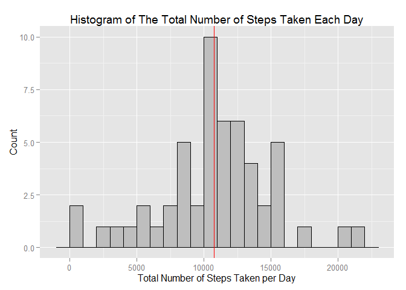
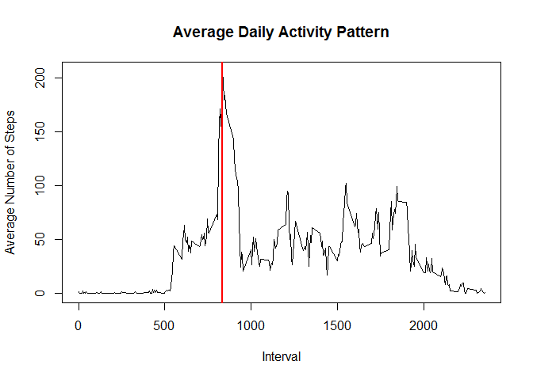
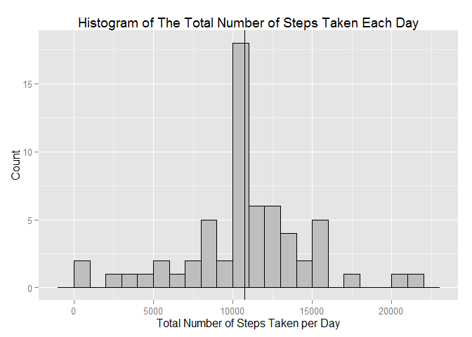
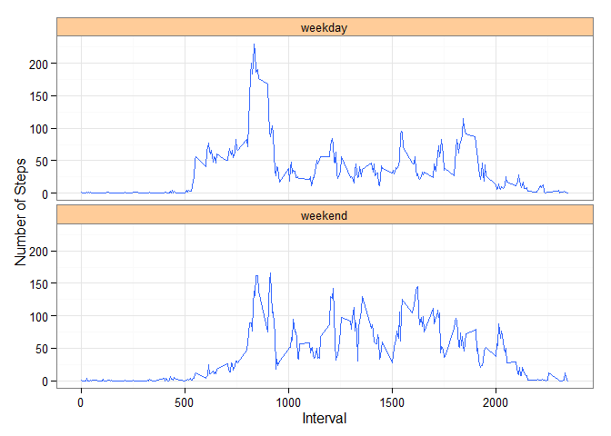

# Reproducible Research: Peer Assessment 1
Shuoyenl  
Wednesday, May 13, 2015  

This is an R Markdown document which addresses the following questions about the dataset [Activity monitoring data](https://d396qusza40orc.cloudfront.net/repdata%2Fdata%2Factivity.zip) [52K] for **the reproducible research's peer assessment 1**. 


### Loading and preprocessing the data

- Load the activity data from activity.csv and convert the date column to type Date:

```r
activity <- read.csv("activity.csv")
activity$date <- as.Date(activity$date)
```


### What is mean total number of steps taken per day?

- Ignore the missing values in the dataset and calculate the total number of steps taken each day:

```r
library(plyr)
activity.validSteps <- activity[!is.na(activity$steps),]
dailyTotalSteps <- ddply(activity.validSteps, .(date), summarize, totalSteps = sum(steps, na.rm = TRUE))
```


- Calculate and report the **mean** total number of steps taken per day:

```r
dailyTotalSteps.mean <- round(mean(dailyTotalSteps$totalSteps, na.rm = TRUE), 2)
dailyTotalSteps.mean
```

```
## [1] 10766.19
```


- Calculate and report the **median** total number of steps taken per day:

```r
dailyTotalSteps.median <- round(median(dailyTotalSteps$totalSteps, na.rm = TRUE), 2)
dailyTotalSteps.median
```

```
## [1] 10765
```


- Make a histogram of the total number of steps taken each day:

```r
library(ggplot2)
g <- ggplot(dailyTotalSteps, aes(x=totalSteps))
g + geom_histogram(fill="grey", colour="black", binwidth = 1000) + 
    labs(title="Histogram of The Total Number of Steps Taken Each Day", x = "Total Number of Steps Taken per Day", y = "Count") +
    geom_vline(xintercept = c(dailyTotalSteps.mean, dailyTotalSteps.median), colour=c("blue", "red"))
```

 

*Note: The mean and the median are very close which makes them looks like overlapping each other in the histogram.*


### What is the average daily activity pattern?

- Calculate the average number of steps taken in each of the 5-minute interval, averaged across all days:

```r
intervalAvgSteps <- ddply(activity.validSteps, .(interval), summarize, avgSteps = mean(steps, na.rm = TRUE))
```


- Find the 5-minute interval which contains the maximum number of steps on average across all the days in the dataset:

```r
intervalAvgSteps.max = intervalAvgSteps[which.max(intervalAvgSteps$avgSteps), ]
intervalAvgSteps.max$interval
```

```
## [1] 835
```


- Make a time series plot (i.e. `type = "l"`) of the 5-minute interval (x-axis) and the average number of steps taken, averaged across all days (y-axis) and show the 5-minute interval which contains the maximum number of steps:

```r
plot(x=intervalAvgSteps$interval, y=intervalAvgSteps$avgSteps, type="l", main="Average Daily Activity Pattern", xlab="Interval", ylab="Average Number of Steps")
abline(v=intervalAvgSteps.max$interval, col="red", lwd=2)
```

 


### Imputing missing values

- Merge the *activity* and the *intervalAvgSteps* (calculated in the previous section) by the *interval* so we can replace the missing steps with the mean for that 5-minute interval later:

```r
activity.modified <- merge(activity, intervalAvgSteps, by="interval", all=TRUE)
```


- Calculate and report the total number of missing values in the dataset (i.e. the total number of rows with `NA`s):

```r
nas <- is.na(activity.modified$steps)
sum(nas)
```

```
## [1] 2304
```


- Fill in all of the missing values in the datasetusing the mean for that 5-minute interval:

```r
activity.modified$steps[is.na(activity.modified$steps)] <- activity.modified$avgSteps[is.na(activity.modified$steps)]
```

*activity.modified* is now a dataset that is equal to the original dataset but with the missing data filled in. 


- Calculate the total number of steps taken each day from the modified data set:

```r
dailyTotalSteps.modified <- ddply(activity.modified, .(date), summarize, totalSteps = sum(steps))
```


- Calculate and report the **mean** total number of steps taken per day from the modified dataset:

```r
dailyTotalSteps.modified.mean <- round(mean(dailyTotalSteps.modified$totalSteps, na.rm = TRUE), 2)
dailyTotalSteps.modified.mean
```

```
## [1] 10766.19
```

The mean of the original dataset is 10766.19 and the modified mean is 10766.19.


- Calculate and report the **median** total number of steps taken per day from the modified dataset:

```r
dailyTotalSteps.modified.median <- round(median(dailyTotalSteps.modified$totalSteps, na.rm = TRUE), 2)
dailyTotalSteps.modified.median
```

```
## [1] 10766.19
```

The median of the original dataset is 10765.00 and the modified median is 10766.19.


- Make a histogram of the total number of steps taken each day:

```r
g <- ggplot(dailyTotalSteps.modified, aes(x=totalSteps))
g + geom_histogram(fill="grey", colour="black", binwidth=1000) + 
    labs(title="Histogram of The Total Number of Steps Taken Each Day", x = "Total Number of Steps Taken per Day", y = "Count") +
    geom_vline(xintercept = c(dailyTotalSteps.modified.mean, dailyTotalSteps.modified.median))
```

 

*Note: The mean and the median are identical and overlap each other in the histogram.*


### Are there differences in activity patterns between weekdays and weekends?

- Create a new factor variable in the dataset with two levels -- "weekday" and "weekend" indicating whether a given date is a weekday or weekend day:

```r
activity.modified$weekday <- weekdays(activity.modified$date)
activity.modified$dateType <- ifelse(factor(activity.modified$weekday) %in% c("Saturday", "Sunday"), "weekend", "weekday")
```


- Make a panel plot containing a time series plot (i.e. `type = "l"`) of the 5-minute interval (x-axis) and the average number of steps taken, averaged across all weekday days or weekend days (y-axis):

```r
intervalAvgSteps.Modified <- ddply(activity.modified, .(interval, dateType), summarize, avgSteps = mean(steps, na.rm = TRUE))

g <- ggplot(intervalAvgSteps.Modified, aes(interval, avgSteps))
g + geom_line(color="#3366FF") + facet_wrap(~dateType, nrow = 2, ncol = 1) + ylab("Number of Steps") + xlab('Interval') + theme_bw() + theme(strip.background = element_rect(fill = "#FFCC99"))
```

 

*Note: We use ggplot to draw the time series plot here while it can also be done using plot (see what we did in the section of "What is the average daily activity pattern").*
